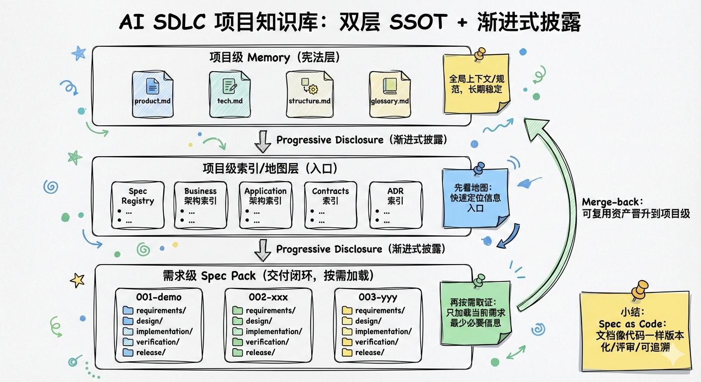

---
markdown-sharing:
  uri: 090998fa-c053-4400-8c18-27581d8c17b7
---
# AI SDLC project ideas and progress report (2026-02-09)

> Reporting Scope: Focus`design/`The design plans and staged progress that have been accumulated in the directory (methodology, information architecture, placement specifications, AI efficiency improvement process in the demand analysis stage, etc.).  

## 1. Project background and problems to be solved

The company promotes the upgrading of new R&D paradigms, hoping to engineer and standardize "knowledge organization methods" and "R&D process methodologies", and use AI to achieve stable efficiency improvements and continuous evolution. This project focuses on two core pain points:

- **Knowledge is scattered and context is lost**: Requirements/design/contract/operation and maintenance information is scattered in many places, making cross-role collaboration costly and easy to rework.
- **AI efficiency improvement is unstable**: AI lacks unified constraints on "what to read/what to write/how to accept" at different stages, resulting in output caliber drift and weak traceability.

## 2. Overall Goal (North Star)

- **Establish AI SDLC project knowledge base**: Form a sustainably maintained project-level knowledge asset (long-term fact source), supporting retrieval, citation and traceability.
- **Establish SOPs for each node, and use AI to assist in improving efficiency at each stage**: Solidify the input/output/access control/evidence of each step into workflows and templates, making best practices the default path.

## 3. Core ideas (overview of methodology)

The overall design of the project revolves around 5 key concepts (see`design/aisdlc.md`):

### 3.1 Double-layer SSOT: project-level SSOT + demand-level Spec Pack

- **Project-level SSOT (long-term assets)**: a stable, governable, and reusable "project source of fact" that serves long-term evolution across needs and stages.
- **Requirement-level Spec Pack (delivery closed loop)**: an independent specification and evidence package for each requirement, covering closed-loop products from PRD to release to archive; after the requirement is completed, the reusable content is promoted back to the project level through the **Merge-back** mechanism.

### 3.2 Spec as Code

Treat Spec documents like code: version control, review, and evolution with implementation to reduce the systemic risk of "outdated documentation/inconsistent caliber".

### 3.3 Progressive Disclosure

Agent reads the project-level map and specifications first by default ("look at the map first"), and only reads the Spec Pack of the requirement on demand ("then obtain evidence on demand") when the task clearly points to a requirement, to avoid context noise and cross-requirement pollution.

### 3.4 SOP = Workflow + Template + Access Control

- **Workflow**: Define each step "what to read/what to write/how to accept/what is the evidence".
- **Template**: Cured product skeleton (Frontmatter + minimum closed-loop text structure).
- **Access Control**: DoR/DoD, structural integrity, reference/traceability, contract/test/release verification, etc.

### 3.5 Merge-back: Turn short-term delivery into long-term assets

The completion of requirements is not "copying all documents back to the project layer", but screening and promotion according to asset types (ADR, contract, operation and maintenance assets, NFR baseline, etc.), and the rest is archived as delivery evidence to support audit and review.

## 4. Overall design (information architecture and placement form)

### 4.1 Top-level information layering and reading order

- **Project-level Memory (Constitution/Global Context)**: Global constraints and entrances such as business, technology, structure, terminology, etc.
- **Project-level map layer (Index/Registry)**: Index and navigation entrance (component/business module/contract/ADR, etc.).
- **Requirement-level Spec Pack (load on demand)**: Specifications and evidence of a closed-loop delivery around a single requirement.
- **Deliverable layer (code/test/operation and maintenance)**: Traceably linked to Spec.

Recommended reading order (for Agent): project level first`memory/`and index → ​​then read a certain`specs/<DEMAND-ID>/`→ Write back the product and promote reusable assets in Merge-back.

### 4.2 Directory structure agreement (can be implemented directly)

The core structure is:

-`.aisdlc/project/`: Project-level SSOT (Long-term Assets: Memory/ADR/Contracts/Products/Components/Ops/NFR/Registry)
-`.aisdlc/specs/<DEMAND-ID>/`：Requirement-level Spec Pack (delivery closed loop: requirements/design/implementation/verification/release/merge_back)

### 4.3 7-stage closed loop of demand-level Spec Pack (top-level planning)

The requirements-level Spec Pack defines the minimum core output of 7 stages: product requirements, refactoring requirements (optional), requirements design, requirements implementation, requirements testing, release, and Merge-back (archiving and promotion).

### 4.4 Atomic Spec specification (allowing AI to read accurately and write correctly)

- **YAML Frontmatter**: used for indexing, dependencies, tracing (id, stage, status, depends_on, related_code/tests, etc.).
- **Minimum closed-loop text structure**: background and goals, scope, process (Mermaid), rules and boundaries, contract/data, acceptance criteria, traceability links.

### 4.5 Long-term assetization of business architecture and application architecture

The project level is layered according to the enterprise structure:

- **Business Module (`project/products/`)**: Business boundaries, capabilities, processes, business objects/events, rules and calibers, indicators and dependencies (emphasis on business semantics, no implementation details).
- **Application Component (`project/components/`)**: Component boundaries and commitments, application service catalogs, interfaces and contract entries, collaboration relationships, data object responsibilities, NFR allocation and operation entries (emphasis on application layer collaboration boundaries, and does not write one-time delivery details).

## 5. Special example

### 5.1 Unified product framework of “Discover (reverse) ↔ Design (forward)”

On the premise of following the two-tier SSOT and progressive disclosure, a "forward engineering from design assets" plan has been compiled (see details`design/aisdlc_project_discover.md`):

- **Discover (reverse)**: For existing projects, project-level assets are deduced from warehouse facts.
- **Design (forward)**: For greenfield/reconstruction/new modules, first precipitate project-level map layers and contracts (ADR/Contracts), then drive demand-level Spec Pack and implementation, and finally merge-back to complete the implementation evidence entry.

This comparison provides a consistent product structure and management method for subsequent "stock management" and "new project implementation".

### 5.2 Spec-level "product demand development stage" AI efficiency improvement plan (R0-R8)

For the product demand development stage, a set of modular assembly lines that can be distributed, replaceable, and reviewable has been formed (for details, see`design/aisdlc_spec_product.md`):

- **R0 Spec initialization**: Create specification branch and Spec Pack, and download it to disk`requirements/raw.md`as evidence entry.
- **R1 Requirements Clarification**: Output`clarify.md`(Target/User/Scenario/Boundaries/Constraints/Unconfirmed Issues), supports "interactive supplement + incremental write back to raw.md" to ensure traceability.
- **R2 Competitive products/alternative solution analysis (optional)**: Disassemble competing products to form a "function pool/mechanism pool" to provide reusable input for solution refinement.
- **R3 final plan improvement and iteration**: output`solution.md`(Structured plan + coverage verification + risk and verification + iteration record), mandatory access control: you must first get the user plan description.
- **R5 PRD generation**: the output can be reviewed, accepted and disassembled`prd.md`(including AC).
- **R6 scene interaction solution**: output`interaction.md`(Task flow, page structure, exceptions and status, AC → node mapping).
- **R7 Prototype (Wireframe/Text Prototype)**: Output`prototype.md`, emphasizing that the page number is stable, the state machine is testable, the AC is traceable, and includes minimum availability verification and reflow guidelines.
- **R8 front-end DEMO (optional)**: Generate a runnable page based on the prototype for walkthrough alignment, positioned as DEMO (non-production implementation), requiring traceability, isolation, and rollback.

### 5.3 Spec-level "Refactor" SOP (R0-R2: Clarification + Baseline)

Complete the pre-input and access control of "reconstruction class requirements" (see details`design/aisdlc_spec_refactor.md`), the core is to use the minimum closed loop to prevent the refactoring from getting out of control:

- **R1 refactoring clarification**: output`refactors/clarify.md`, force writing of **invariant (Must Not Change)** and **allowed change point (May Change)**, and freeze In/Out.
- **R2 Current vs. Baseline**: Output`refactors/baseline.md`, give at least **1 verifiable baseline**, a first draft of rollback/stop loss, and give a "DoR list for entering the design stage (Design)" at the end of the article.

> Note: The Refactor block only answers "what to do/what must remain unchanged/how to measure the current situation", and subsequent design/implementation/verification/release reuses the general phase SOP.

### 5.4 Spec-level "design phase" SOP (design phase can be skipped; research/design two paragraphs)

Precipitate requirements/reconstruct common design phase SOP (see details`design/aisdlc_spec_design.md`), with "**Decision Doc/RFC**" as the core, focusing on boundaries and trade-offs rather than implementation details:

- **The design phase can be skipped as a whole**: When the requirement boundary is clear, the risk is low, and there are no critical uncertainties, you can directly enter the implementation and`implementation/plan.md`Complete the minimum decision information.
- **research (optional)**: output`design/research.md`, conduct research and analysis on specific technologies/fields, and converge the status quo, constraints, risks and unknown items (unified labeling`NEEDS CLARIFICATION`), providing input to design.
- **design (required; only if the design phase is not skipped)**: output`design/design.md`, covering solution options and recommendations, boundaries, core processes (Mermaid), key trade-offs and risks/validation plans; introducing ADR when necessary.

### 5.5 Spec level "implementation phase" SOP (I1/I2/I3: planning/task decomposition/execution)

General SOP for precipitation implementation stage (see details`design/aisdlc_spec_implementation.md`), putting the “how” into an executable and auditable delivery list:

- **I1 Implementation Plan (required)**: Output`implementation/plan.md`, align scope/milestones/dependencies/risks/acceptance criteria, and list them explicitly`NEEDS CLARIFICATION`.
- **I2 task decomposition (must do)**: output`implementation/tasks.md`, forming an executable, parallelizable, and traceable task list (task → Spec input → deliverable/acceptance point).
- **I3 execution (required)**: parse and execute`tasks.md`For all tasks, write back the completion status one by one, and add the minimum auditable information (submit/PR/change path).

> Key constraints: Decisions and contract changes generated during the implementation phase are first drafted in the **Spec directory** and then promoted to the **Spec directory after merge-back.`project/`, to avoid direct contamination of project-level long-term assets during the delivery process.

## 7. Current progress (as of 2026-02-09)

### 7.1 Completed/precipitated key documents

-`design/aisdlc.md`: Overall project plan (two-tier SSOT, progressive disclosure, directory structure, 7-stage closed loop, Merge-back, atomic Spec specification, business/application architecture assetization).
-`design/aisdlc_project_discover.md`: Discover ↔ Design’s reverse comparison and forward implementation rhythm (the construction sequence and quality threshold of Level-0/Level-1 assets).
-`design/aisdlc_spec_product.md`: Spec-level product requirements development end-to-end process (R0-R8), disk placement structure, reading sequence, access control and DoD.
-`design/aisdlc_spec_refactor.md`: Spec-level refactoring phase SOP (R0-R2: Clarification + Baseline), emphasizing invariants/allowable change points, baseline metrics, rollback stop loss and DoR entering Design.
-`design/aisdlc_spec_design.md`: Spec-level design phase SOP (design phase can be skipped; research/design two paragraphs), with design decision-making as the core (Decision Doc/RFC), focusing on boundaries and trade-offs.
-`design/aisdlc_spec_implementation.md`: Spec-level implementation phase SOP (I1/I2/I3: planning/task decomposition/execution), emphasizing task list drive, status writeback and auditable closed loop.

## 7.2 Implementation status

- **Pilot Implementation**: The end-to-end development process of **2 product requirements** has been implemented on a pilot basis in the Open Platform Ecological Center (executed according to Spec Pack product placement and access control).
- **Other pilots**:
  * Cloud resource module reconstruction: SDD trial, project reverse engineering
  * Store environment module reconstruction: SDD trial, project reverse engineering
  * Performance tools: project reverse engineering, requirements + design + implementation, Merge-back
- **Phase Conclusion**: The process can be run through and the products can be precipitated; at this stage, the main focus of work has shifted from "methodology and templates" to "stage SOP completion + quantifiable measurement + continuous promotion".

### 7.3 To-do and completion items (for implementation closed loop)

- **Testing phase SOP (Verification)**: Complete the placement specifications, access control and traceability of the test plan/use case/report (AC → Use case → Report).
- **Operation and Maintenance/Release Phase SOP (Release/Ops)**: Complete the placement specifications and access control of the release plan, runbook, monitoring alarms, and rollback plans.
- **Merge-back mechanism implementation**: Form an executable list and evidence entry to support the promotion of ADR/Contracts/Ops/NFR and other assets to project-level SSOT.
- **Efficiency Improvement Index System**: Define quantifiable indicators and collection criteria (efficiency/rework/consistency/traceability, etc.) to evaluate pilot and promotion effects.

### 7.4 Process verification and implementation path (covering typical scenarios)

- **Project Reverse (Discover)**: For existing projects, verify that the construction and backfill path of Level-0/Level-1 assets is executable.
- **Reconstruction process**: For reconstruction scenarios such as cloud resources and store environments, verify whether "invariants/allowable change points/baseline/rollback stop loss/DoR" can be closed stably.
- **No product development process (performance tool type)**: Verify that in the absence of complete product link input, small requirements can use the minimum input to run through the direct path of "design can be skipped → I1" (or only generate`design/design.md`After the minimum decision, enter I1).
- **Quick iteration process for small requirements**: Verify the access control strategy, minimum set of products and traceability requirements under short paths to ensure "fast" without sacrificing auditability and consistency.