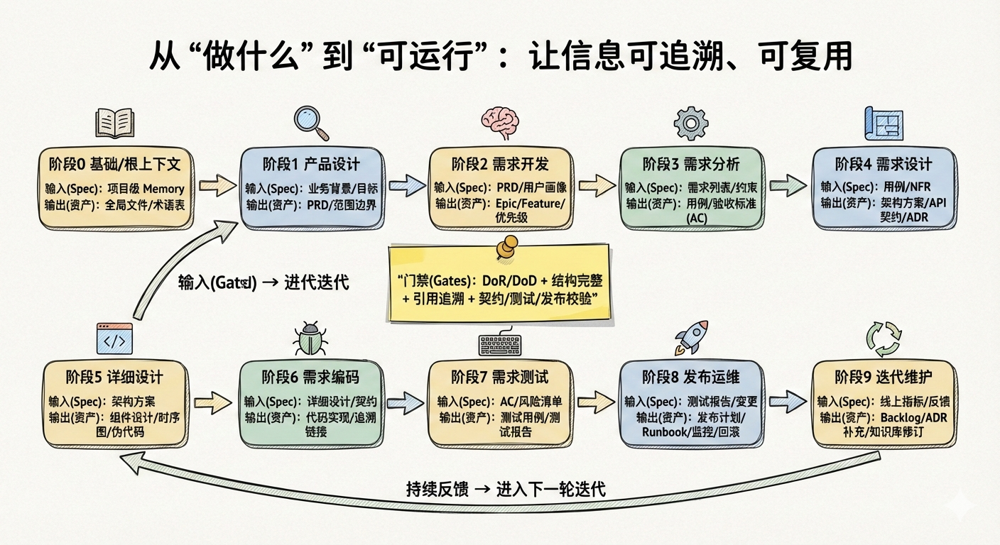

# 🚀 让 AI 真正理解你的项目：AI SDLC 知识库来了！

## 你是否也遇到过这些困扰？

- 📄 文档散落在各处，找一份需求文档要翻遍 N 个系统
- 🔄 代码改了，文档却没更新，最后发现文档和代码"各说各话"
- 🤖 想让 AI Agent 帮你写代码，但它总是理解错业务逻辑
- 📚 团队的最佳实践难以沉淀，每次都要重新摸索
- 🔍 需求从 PRD 到上线，中间发生了什么？找不到完整的追溯链路

**如果以上任何一条戳中了你，那么今天要介绍的产品，就是为你量身打造的！**

---

## ✨ 隆重介绍：AI SDLC 项目知识库

我们推出了一套全新的 **AI SDLC 项目知识库**方案，它不仅仅是一个文档管理系统，更是一个**让 AI Agent 真正理解项目、让团队知识有序沉淀、让最佳实践自动复用的智能知识体系**。

---

## 🎯 核心设计思路

### 设计理念：项目级 SSOT + 需求级 Spec Pack + 渐进式披露 + SOP

我们的设计遵循一个核心理念：**让知识有层次、有秩序、可追溯**。

#### 1️⃣ 双层 SSOT（单一事实源）

- **项目级 SSOT**：长期稳定的知识资产
  - 像"宪法"一样，定义项目的根本规则和架构
  - 包含：产品愿景、技术架构、业务模块、应用组件、对外契约、运行手册等
  - **长生命周期、强治理**：持续更新，形成项目的长期知识资产

- **需求级 Spec Pack**：每个需求的交付闭环
  - 每个需求有自己的"Spec 包"，覆盖从 PRD 到发布的完整链路
  - **短生命周期、强时效**：文档随代码一起演进，避免脱节
  - 需求完成后，通过 **Merge-back** 机制将可复用资产"晋升"到项目级

#### 2️⃣ 渐进式披露：先看地图，再按需取证

AI Agent 不需要一次性加载所有信息，而是：
1. **先看地图**：加载项目级全局规范和索引（了解项目全貌）
2. **再按需取证**：当任务明确指向某个需求时，才读取该需求的 Spec Pack

这样既保证了效率，又避免了信息过载。

#### 3️⃣ Spec as Code：文档即代码

将 Spec 文档当做项目代码一样对待：
- ✅ 版本控制
- ✅ 代码审查
- ✅ 持续更新
- ✅ 可追溯性（Spec ↔ 代码 ↔ 测试 ↔ 发布文档）

#### 4️⃣ SOP：工作流 + 模版，让最佳实践成为默认路径

用**工作流**定义"每一步读什么/写什么/怎么验收"，用**模版**固化"怎么写"，让最佳实践成为默认路径，而不是"知道但做不到"。

---

## 🔄 SDLC 全流程支持

我们的知识库覆盖 SDLC 的完整 10 个阶段，每个阶段都有明确的输入（Spec）和输出（资产）：

| 阶段 | 核心价值 | 输入 | 输出 |
|------|---------|------|------|
| 0. 基础/根上下文 | 统一价值观、术语、约束 | 项目级 Memory | 全局文件、术语表 |
| 1. 产品设计 | 明确"做什么/为什么做" | Memory + 业务背景 | PRD、范围边界 |
| 2. 需求开发 | 从想法到可交付的需求 | PRD + 用户画像 | Epic/Feature 列表 |
| 3. 需求分析 | 把需求写成可实现的规格 | 需求列表 + 术语表 | 用例、验收标准 |
| 4. 需求设计 | 将需求映射到技术方案 | 用例 + 架构 | 架构方案、API 契约 |
| 5. 详细设计 | 可编码的细粒度设计 | 架构方案 | 组件设计、时序图 |
| 6. 需求编码 | 产出可运行代码 | 详细设计 | 代码实现、追溯链接 |
| 7. 需求测试 | 验证符合 Spec | 验收标准 | 测试用例、测试报告 |
| 8. 发布运维 | 安全上线与可观测运行 | 测试报告 | Runbook、监控告警 |
| 9. 迭代维护 | 基于反馈持续演进 | 用户反馈 | Backlog、ADR 更新 |

每个阶段的输出都会**自动入库**，形成完整的追溯链路。

---

## 💎 核心价值

### 对团队而言

- ✅ **统一知识库**：所有项目知识集中管理，不再散落各处
- ✅ **可追溯性**：从 PRD 到代码到测试到发布，完整链路一目了然
- ✅ **规范流程**：SOP 工作流和模版让最佳实践成为默认路径
- ✅ **知识沉淀**：Merge-back 机制让可复用知识自动沉淀到项目级

### 对 AI Agent 而言

- ✅ **高效理解**：渐进式披露让 Agent 快速了解项目全貌
- ✅ **准确执行**：Spec 与代码同步，Agent 基于最新、最准确的信息工作
- ✅ **减少错误**：清晰的追溯链路和验收标准，减少理解偏差

### 对组织而言

- ✅ **知识资产化**：项目知识不再是"文档"，而是可治理、可复用的资产
- ✅ **最佳实践复用**：工作流和模版让成功经验可复制
- ✅ **持续改进**：通过 Merge-back 和迭代，知识库持续演进

---

## 🎨 视觉化理解

我们提供了两张 Excalidraw 风格的商业思维视觉笔记，帮助你快速理解核心概念：

1. **架构图**：展示双层 SSOT 的层次结构和渐进式披露机制
2. **流程图**：展示 SDLC 10 个阶段的信息流转和资产沉淀

（图片已嵌入上方，如未显示请检查 `article/imgs/` 目录）

---

## 🚀 立即行动

**这不仅仅是一个工具，更是一次工作方式的变革！**

我们相信，当 AI Agent 真正理解项目、当知识有序沉淀、当最佳实践自动复用，我们的开发效率和质量将迎来质的飞跃。

### 我们诚邀你：

1. **试用体验**：在你的项目中尝试建立 `.aisdlc` 知识库结构
2. **反馈建议**：告诉我们你的使用体验和改进建议
3. **最佳实践分享**：如果你有好的工作流和模版，欢迎分享给团队

### 参与方式

- 📧 联系产品团队获取详细文档和模版
- 💬 加入内部讨论群，与团队一起探索最佳实践
- 📝 提交 Issue 或 PR，直接参与产品改进

---

## 🌟 让我们一起，让 AI 真正理解项目，让知识有序沉淀，让最佳实践成为默认路径！

**未来已来，让我们一起拥抱变革！** 🎉

---

*本文档基于 AI SDLC 项目知识库设计方案撰写，更多技术细节请参考 `design/aisdlc.md`*
