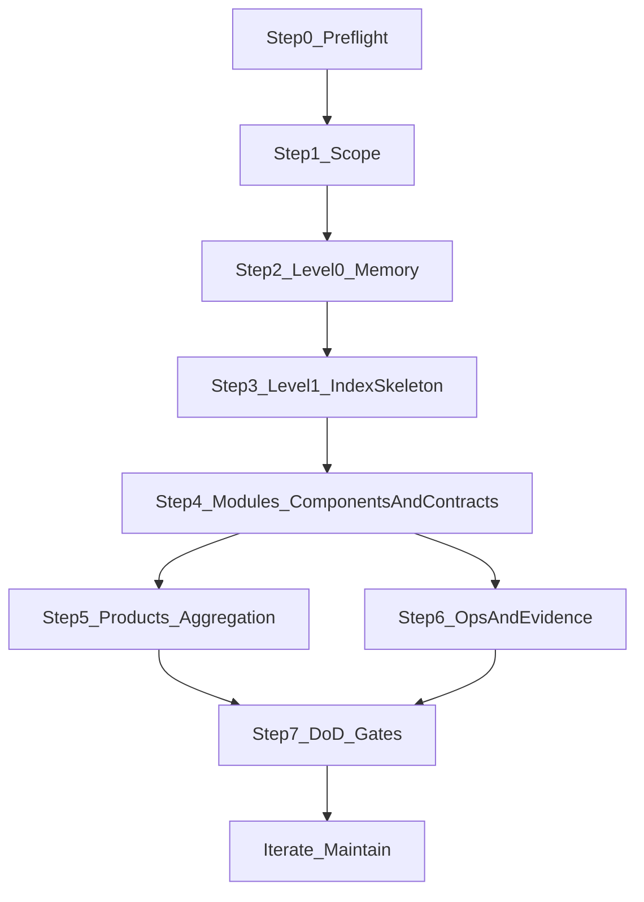

# AI SDLC：存量项目 Discover（逆向）SOP —— 从代码反向产出项目知识库

> 本文是**项目知识库建设的设计指南（逆向工程版）**：面向“已有代码的存量项目”，用一套可执行的 SOP，把仓库事实（代码/配置/CI/契约/运行入口）反向沉淀为 `.aisdlc/project/` 项目级 SSOT。
> 重点不是“把代码翻译成文档”，而是建立**地图层 + 权威入口 + 证据链**，让后续 AI 辅助开发更稳定、更少猜测、更可追溯。

---

## 0. 你会得到什么（收益）与不做什么（止损线）

### 0.1 主要收益（面向 AI + 面向协作）

- **减少 AI 的“猜边界/猜入口”**：项目级地图层把“哪里是权威、从哪里进、边界在哪”固定下来。
- **减少重复扫描与上下文浪费**：索引只做导航，细节按需进入模块页/契约入口页。
- **提升一致性与可追溯**：把契约（API/Data）、关键决策（ADR）、运行入口（ops）变成可链接的证据链。
- **降低返工**：当发生变更/故障/对接时，能快速定位“该看哪里、该改哪里、如何验证”。

### 0.2 非目标（避免维护成本爆炸）

- 不追求“全量字段级数据字典”；除非合规/对账/KPI 口径治理需要，否则只做**权威入口页 + 不变量摘要 + 证据链接**。
- 不把需求级一次性交付细节写进项目级；一次性交付细节归档在 `specs/<DEMAND-ID>/`，可复用资产通过 Merge-back 晋升回项目级（原则见 `design/aisdlc.md`）。

---

## 1. 产物与落盘位置（项目级 SSOT）

> 下面是**输出的标准落盘结构**。模板来源可能来自 `templates/`、`.aisdlc-cli/templates/` 或仓库自定义位置；若仓库内不存在模板，就按本文的“最小模板”手工创建即可（目标是结构与证据链，而不是模板来源）。

### 1.1 Level-0（北极星 / Memory）

- `.aisdlc/project/memory/structure.md`：仓库结构与入口（如何定位模块、如何运行/测试/发布的入口链接）
- `.aisdlc/project/memory/tech.md`：技术栈与工程护栏（质量门禁、依赖约束、NFR 预算入口）
- `.aisdlc/project/memory/product.md`：业务边界与核心术语入口（只写稳定语义）
- `.aisdlc/project/memory/glossary.md`：术语表（尽量短，链接到权威出处）

### 1.2 Level-1（地图层索引）

- `.aisdlc/project/components/index.md` 与 `.aisdlc/project/components/{module}.md`：应用组件地图与模块页
- `.aisdlc/project/products/index.md` 与 `.aisdlc/project/products/{module}.md`：业务模块地图与模块页（可选；但建议收敛到 <= 6）
- `.aisdlc/project/contracts/index.md`：契约总索引
- `.aisdlc/project/contracts/api/index.md` 与 `.aisdlc/project/contracts/api/{module}.md`：API 契约入口（权威入口页）
- `.aisdlc/project/contracts/data/index.md` 与 `.aisdlc/project/contracts/data/{module}.md`：数据契约入口（权威入口页）

### 1.3 运行入口（可选但高 ROI）

- `.aisdlc/project/ops/`：Runbook/监控告警/回滚等“入口页”（不重复操作步骤，只挂链接与要点）
- `.aisdlc/project/nfr.md`：NFR 预算/基线（若团队已有体系，可只做入口链接）

---

## 2. SOP 总览（先有地图，再逐步补证据）

---

## 3. Step 0：Preflight（准备与素材盘点）

**目标**：先把“有哪些事实可作为证据”盘清楚，后续写入知识库的不是观点，而是“入口链接 + 证据位置”。
**原则**：优先引用“可执行证据”（脚本/CI/契约文件），其次才是描述性文档。

### 输入

- 仓库（目录结构、构建脚本、依赖文件、配置文件、CI/CD 配置）
- 运行方式（本地启动、环境变量、部署入口）
- 测试入口（单测/集成测/E2E、质量门禁）
- 已有契约与结构化事实（OpenAPI/Proto/JSON Schema/SQL migrations/ORM models）
- 可观测性入口（监控、日志查询、告警、Runbook、回滚策略）

### 动作（最小清单）

- 找到**唯一可信入口**（优先脚本/CI/README/Makefile/package.json 等可执行证据）
- 标记：哪些是“长期稳定入口”（适合项目级），哪些是“需求一次性细节”（适合留在 spec）
- 汇总一份“证据入口清单”（可先做草稿，后续分散写入模块页/契约页/ops 页）

### 输出

- 一份可追溯的入口清单（链接到：运行/测试/CI/契约/关键目录/监控告警）

---

## 4. Step 1：Scope（范围止损：P0/P1/P2）

**目标**：逆向工程最大风险是“试图覆盖所有模块导致维护失败”。Scope 的任务是先明确：哪些模块必须做、哪些可以按需做、哪些暂缓。

### 4.1 模块分级（建议）

- **P0（必须逆向）**：高频变更、跨团队交界、对外集成多、事故/故障热点、合规风险高
- **P1（建议逆向）**：稳定但经常被引用/被问到/被依赖的基础能力
- **P2（按需逆向）**：低风险、低协作、生命周期短；只保留索引占位与入口

### 4.2 逆向深度与产物要求（强约束）

- P0：必须同时具备 `components/{module}.md` + `contracts/api/{module}.md` + `contracts/data/{module}.md` + 证据入口（代码/测试/CI/ops）
- P1：必须具备 `components/{module}.md` 与至少一个契约入口页（API 或 Data），其余按需
- P2：只在 `components/index.md` 与 `products/index.md` 占位，保留入口链接即可

---

## 5. Step 2：Level-0（Memory / 北极星）

**目标**：让任何人/AI 在 3 分钟内知道：项目是什么、边界是什么、怎么跑、怎么验证、权威入口在哪。

### 5.1 写法约束（项目级必须短）

- **只写稳定入口与边界**：目录/命令/契约/运行入口/护栏
- **避免一次性交付细节**：字段级约束、详细时序、迁移步骤下沉到 spec

### 5.2 Memory 最小模板（可复制）

#### `memory/structure.md`

- 项目形态：单体/多服务/Monorepo（以仓库事实为证据）
- 入口：
  - 本地启动：`<命令/脚本路径>`
  - 测试：`<命令/脚本路径>`
  - 构建/发布：`<CI job / pipeline 链接或脚本>`
- 代码地图：
  - 组件索引入口：`components/index.md`
  - 契约索引入口：`contracts/index.md`
  - 运行入口：`ops/`（若有）

#### `memory/tech.md`

- 技术栈：语言/框架/数据库/消息/网关（只列稳定选择）
- 质量门禁入口：lint/test/安全扫描（命令与 CI job 链接）
- NFR 护栏入口：性能/可用性/成本/安全（链接到 `nfr.md` 或外部规范）

#### `memory/product.md`

- 业务边界：In/Out（一句话 + 证据入口）
- 关键业务模块入口：`products/index.md`（若有）
- 关键术语入口：`glossary.md`

#### `memory/glossary.md`

- 术语：定义（1 句）+ 权威出处链接（ADR/契约/代码类型/外部文档）

---

## 6. Step 3：Level-1（索引骨架 + 复选框任务面板）

**目标**：先生成“地图骨架”，再按模块迭代补齐；索引只做导航与进度面板。

### 6.1 索引写法约束

- `index.md` **只做导航**：表格列出模块/Owner/入口/契约链接/运行链接；不复制模块细节
- 用复选框管理补齐进度：
  - `- [ ] moduleA` 表示模块页/契约入口页未完成
  - `- [x] moduleA` 表示已达到该模块的 DoD

---

## 7. Step 4：Modules（组件页 + 契约入口页：把“权威”立起来）

**目标**：对每个选中的模块（优先 P0），同时产出组件页与契约入口页，并回填索引。
**关键约束**：契约页不是“字段大全”，而是“权威入口 + 不变量摘要 + 证据入口”。

### 7.1 `components/{module}.md` 最小模板（可复制）

- 模块定位：In/Out（明确不负责什么）
- Owner：团队/系统负责人（可链接到组织通讯录/值班表）
- 入口：
  - 代码入口：`<目录/路由/handler/consumer/job/cli 的路径>`
  - 运行入口：`ops/<...>`（若有）
- 承载的业务映射（若有 `products/*`）：CAP/BP/BO 编号或最小引用
- 对外接口与契约入口：
  - API：链接到 `contracts/api/{module}.md`
  - Data：链接到 `contracts/data/{module}.md`
- 代表性协作场景（1–2 个）：只写“谁调用谁 + 关键边界”，详细时序下沉 spec
- NFR 分摊摘要：性能/可用性/安全关键点（只写护栏与入口）
- 证据链接：
  - 关键测试入口：`<tests/...>` 或 CI job
  - 关键监控/告警入口：`<dashboard/alert>`（若有）

### 7.2 `contracts/api/{module}.md` 最小模板（可复制）

- 权威入口（必须可点击/可定位）：
  - OpenAPI/Proto 文件：`<path 或外部链接>`
  - 网关/路由入口：`<path>`
- 不变量摘要（3–7 条）：鉴权、幂等、错误码族、版本/兼容策略、审计要求
- 版本与弃用策略（最小化）：当前版本、废弃窗口、变更记录入口（链接到 ADR 或变更日志）
- 证据入口：
  - 相关 handler/路由：`<path>`
  - 相关测试：`<path>`
  - CI 门禁：`<job/命令>`

### 7.3 `contracts/data/{module}.md` 最小模板（可复制）

- 数据主责（Ownership）：主写/只读/同步来源（明确边界）
- 核心对象与主键：对象名 + 主键/唯一标识 + 生命周期一句话
- 权威入口：
  - Schema/DDL/迁移：`<path>`
  - ORM model：`<path>`（如适用）
- 不变量摘要：口径、状态机、约束（3–7 条）
- 数据质量与审计入口（如适用）：规则/对账/稽核
- 证据入口：关键查询/报表/任务（仅入口，不写全量 SQL）

---

## 8. Step 5：Products（业务模块聚合与收敛 <= 6）

**目标**：从存量代码推导出“可治理的业务模块地图”，并把数量收敛到 <= 6（否则认知与维护会失控）。

### 8.1 从代码反推业务模块的线索（建议优先级）

- 数据主责（最强线索）：哪个模块主写哪些核心对象（见 `contracts/data/*`）
- 对外能力边界：哪些 API 是面向外部/其他系统的稳定承诺（见 `contracts/api/*`）
- 组织边界：不同团队负责的模块群（Owner）
- 运行边界：独立部署/独立扩缩容/独立 SLO 的单元（若有）

### 8.2 无法收敛时怎么办

- 允许 >6，但必须写明原因（合规隔离/数据主责分裂/组织边界/历史包袱），并给出治理建议（拆分/合并/迁移路线的入口）。

---

## 9. Step 6：Ops & Evidence（运行入口与证据链）

**目标**：把“能跑、能验、能回滚、能排障”的入口固定下来，这往往比补全字段字典更高 ROI。

### 9.1 运行入口页的写法约束（短、可执行、可升级）

- Runbook/告警说明要**可操作**：避免泛泛“检查日志”，应提供具体入口（dashboard、日志查询、常见修复、升级联系人）。
  - 参考：Google SRE Workbook
    - `https://sre.google/workbook/incident-response/`
    - `https://sre.google/workbook/postmortem-culture/`

### 9.2 证据链（写在入口页里）

- Spec（需求） ↔ Contracts（契约） ↔ Code（实现入口） ↔ Tests（验证入口） ↔ CI（门禁） ↔ Ops（运行入口）

---

## 10. Step 7：DoD（完成标准）与门禁建议

### 10.1 项目级 DoD（最小自检清单）

- [ ] Level-0 四份 Memory 已具备“入口清晰/边界清晰/可导航”
- [ ] Level-1 索引骨架已生成，且复选框任务清单可用
- [ ] 每个 P0 模块都满足：组件页 + API 契约入口页 + Data 契约入口页 + 证据入口
- [ ] products 已收敛到 <= 6；或已记录不可收敛原因与治理建议
- [ ] 索引只导航，细节不双写；模块页/契约页是权威入口

### 10.2 门禁建议（写在 SOP 里，但不在此处实现）

- **Docs-as-Code**：文档与代码同 PR、同评审；提供 PR 预览；自动检查断链/格式
  - 参考：Read the Docs（docs-as-code、PR previews）
    - `https://about.readthedocs.com/docs-as-code`
- **Catalog 完整性**：P0 模块必须存在组件页与契约入口页；在 CI 中 enforce（借鉴软件目录/服务目录治理思路）
  - 参考：Backstage（确保 catalog 完整性）
    - `https://backstage.io/docs/golden-path/adoption/full-catalog`

---

## 11. 常见陷阱与规避（逆向工程版）

- **陷阱：试图一次性写全**
  - **规避**：先 Scope 分级；P0 先落地，再迭代补齐 P1/P2
- **陷阱：把一次性交付细节写进项目级**
  - **规避**：项目级只写入口/边界/护栏；字段级与时序级细节下沉 spec，复用资产再 Merge-back
- **陷阱：索引与模块双写**
  - **规避**：索引只导航；模块页/契约页是权威；索引只回填摘要 + 链接
- **陷阱：契约不权威**
  - **规避**：契约页至少要有“权威入口链接 + 不变量摘要 + 证据入口”；必要时用 ADR 记录取舍

---

## 附录 A：Discover 与 Design 的关键差异（仅保留 5 条）

- **证据来源**：Discover 以仓库事实为证据；Design 以 ADR/Contracts 等设计资产为证据并在实现后补齐代码入口。
- **起步方式**：Discover 先 Preflight + Scope，再补地图层；Design 先定义地图层与契约，再驱动实现。
- **风险**：Discover 最大风险是“覆盖面失控”；Design 最大风险是“契约不落地/实现漂移”。两者都用“门禁 + 证据链 + Merge-back”降低风险。
- **契约形态**：Discover 倾向“先链接到现有 schema/代码入口”；Design 倾向“先定义权威契约再实现对齐”。共同原则：契约必须权威、可追溯、可验证。
- **输出位置**：共同输出都落在 `.aisdlc/project/`；需求级细节仍在 `.aisdlc/specs/<DEMAND-ID>/`。

---

## 附录 B：行业最佳实践（用于约束写法与治理，不要求照搬）

- 文档信息架构（Diátaxis：Tutorial/How-to/Reference/Explanation）：`https://diataxis.fr/foundations/`
- Docs-as-Code（Git 版本化、PR 预览、自动部署示例）：`https://about.readthedocs.com/docs-as-code`
- ADR（Michael Nygard 模板，用于记录关键取舍）：`https://tarf.co.uk/Reference/Architecture/adr/decision_record_template/`
- 架构地图分层（C4 Model）：`https://c4model.com/`
- SRE（incident response & postmortem）：
  - `https://sre.google/workbook/incident-response/`
  - `https://sre.google/workbook/postmortem-culture/`
- 软件目录/服务目录治理（Backstage catalog 完整性）：`https://backstage.io/docs/golden-path/adoption/full-catalog`

