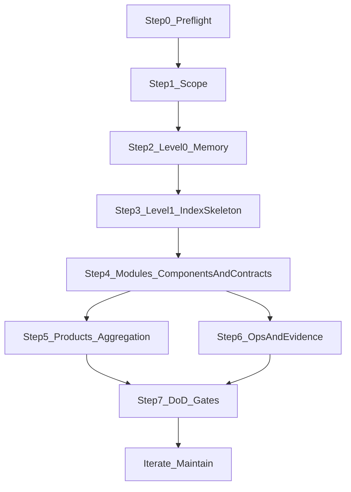

# aisdlc-project-discover（存量项目 Discover / 逆向建项目级知识库）

## 概览

这个 Skill 是“**导航 + 门禁**”型：把存量项目的仓库事实（代码/配置/CI/契约/运行入口）沉淀为 `.aisdlc/project/` 的项目级 SSOT。

**核心原则：**

- **项目级只写稳定入口与边界**：入口链接 + 不变量摘要 + 证据入口；不做字段大全。
- **先地图骨架，再补证据**：索引只导航；细节只在模块页/契约入口页。
- **证据链必须可追溯**：Contracts ↔ Code ↔ Tests ↔ CI ↔ Ops（入口串起来）。

**开始时宣布：**「我正在使用 aisdlc-project-discover 技能为存量项目逆向产出 `.aisdlc/project/` 项目级知识库，并执行门禁防跑偏。」

## 何时使用 / 不使用

- **使用时机**
  - 你接手一个已有代码的存量项目，需要为后续协作与 AI 辅助开发建立项目级地图层与权威入口。
  - 团队总在问“入口在哪/谁负责/怎么跑/怎么验/契约在哪”，且反复口头解释导致漂移。
  - 你在压力下容易被要求“先把细节写全/字段字典写全/先写再补索引”。
- **不要用在**
  - 纯“新需求/新功能”规格化交付（那是 Spec Pack 流程）。
  - 需要生成字段级数据字典/全量 API 字段说明作为强交付物（本 Skill 明确反对；除非合规硬要求且另有治理方案）。

## 产物与落盘位置（唯一 SSOT）

> **只落盘到仓库根目录的** `.aisdlc/project/`（不要发明 `.aisdlc/project/docs/*`、`flows/*`、`data-dictionary/*` 这类“细节仓库”来逃避约束）。

- **Level-0（Memory）**
  - `.aisdlc/project/memory/structure.md`
  - `.aisdlc/project/memory/tech.md`
  - `.aisdlc/project/memory/product.md`
  - `.aisdlc/project/memory/glossary.md`
- **Level-1（地图层索引 + 模块页）**
  - `.aisdlc/project/components/index.md` + `.aisdlc/project/components/{module}.md`
  - `.aisdlc/project/products/index.md` + `.aisdlc/project/products/{module}.md`（可选但推荐收敛到 ≤ 6）
- **Contracts（契约入口页）**
  - `.aisdlc/project/contracts/index.md`
  - `.aisdlc/project/contracts/api/index.md` + `.aisdlc/project/contracts/api/{module}.md`
  - `.aisdlc/project/contracts/data/index.md` + `.aisdlc/project/contracts/data/{module}.md`
- **Ops（高 ROI 入口页，可选）**
  - `.aisdlc/project/ops/`（Runbook/监控告警/回滚等入口）
  - `.aisdlc/project/nfr.md`（若团队已有体系，可只做入口链接）

## 一次性交付细节如何处理（沉没成本的正确归宿）

当你手里已有“详细时序/迁移步骤/字段约束/操作手册”这类**一次性交付细节**时：

- **项目级（`.aisdlc/project/`）只保留**：入口链接 + 不变量摘要 + 证据入口（指向代码/契约文件/测试/CI/监控，必要时也可以指向 Spec Pack 的归档文件）。
- **全文细节应归档到**：`.aisdlc/specs/<DEMAND-ID>/...`（或团队既有的外部文档系统），并在项目级通过链接引用。

> 这样做的目的不是“把细节丢掉”，而是避免项目级知识库变成不可维护、长期漂移的细节堆。

## 工作流（总览）

## REQUIRED SUB-SKILL（按步骤执行）

> 每个子技能都提供可复制模板、检查清单、红旗与常见错误反制。

- Step0：`aisdlc-project-discover-preflight`
- Step1：`aisdlc-project-discover-scope`
- Step2：`aisdlc-project-discover-level0-memory`
- Step3：`aisdlc-project-discover-level1-index-skeleton`
- Step4：`aisdlc-project-discover-modules-contracts`
- Step5：`aisdlc-project-discover-products-aggregation`
- Step6：`aisdlc-project-discover-ops-evidence`
- Step7：`aisdlc-project-discover-dod-gates`

## 并行策略（可选，但建议）

当你需要同时逆向多个独立模块（例如 3 个 P0 模块）时：

- **REQUIRED SUB-SKILL：使用 `dispatching-parallel-agents`** 并行派发子智能体
- 每个子智能体只负责一个模块的 Step4（组件页 + API/Data 契约入口页 + 证据入口）
- 控制器负责：Step0/Step1/Step2/Step3 的骨架与门禁，以及最终 DoD 验证与索引回填

## 门禁（必须遵守，否则停止）

- **索引只导航**：`components/index.md` / `contracts/*/index.md` / `products/index.md` 禁止复制模块细节。
- **契约页三件套**：每个 `contracts/api|data/{module}.md` 必须具备：
  - 权威入口（OpenAPI/Proto/Schema/迁移/ORM 模型的路径或链接）
  - 不变量摘要（3–7 条）
  - 证据入口（相关代码入口 + 测试入口 + CI 门禁/命令入口）
- **P0 深度硬约束**：P0 模块必须同时具备 `components/{module}.md` + `contracts/api/{module}.md` + `contracts/data/{module}.md` + 证据入口。
- **Memory 必须短**：`memory/*` 只写稳定入口与边界；禁止写一次性交付细节。

## 红旗清单（出现任一条：停止并纠正）

- “先把字段字典 / API 字段说明写全，越细越好”并要求放进项目级
- “先写细节，索引以后再补”（导致索引双写/地图层失效）
- 试图在 `.aisdlc/project/` 下新增 `docs/data-dictionary/`、`api-reference/`、`flows/`、`ops/runbooks/`、`ops/migrations/` 等“细节仓库”来承载字段级/时序级/迁移级全量内容
- 把一次性交付细节（详细时序/迁移脚本说明/字段约束全集/操作手册完整版）整体并入项目级并承诺“以后只在项目级维护”
- 不能给出“证据入口”时开始脑补（应改为占位 + 证据缺口清单，而不是编造）

## 常见借口与反制（来自基线压测）

| 借口（压力来源） | 常见违规行为 | 必须的反制动作 |
|---|---|---|
| “15 分钟内交付，别问问题，先写满细节” | 把索引写成细节页；Memory 变成长文；缺证据就猜 | **先骨架后证据**：索引只导航；对缺证据只写“入口占位 + 证据缺口清单” |
| “领导要字段大全，放项目级” | 新增 `docs/data-dictionary` / `api-reference` 承载字段级全量 | 回到本 Skill 的**非目标**：项目级只做入口与不变量；需要字段大全时必须另起治理方案（不在本 Skill 内） |
| “我已经写了很多一次性交付细节，全合并进 project” | 新增 `flows/`、`ops/runbooks/`、`ops/migrations/` 等目录承载细节 | 保持项目级短：只保留权威入口与证据链；一次性交付细节不允许成为项目级 SSOT |

## 一个好例子（最短可用的正确交付）

你只需要把 `.aisdlc/project/` 做到“能导航、能定位入口、能追溯证据”：

- `memory/structure.md`：怎么跑/怎么测/怎么发布的入口链接
- `components/index.md`：模块表格 + 复选框进度（不写细节）
- 对每个 P0 模块：`components/{module}.md` + `contracts/api/{module}.md` + `contracts/data/{module}.md`（三件套齐全）
- `ops/`：只做入口页（dashboard/告警/runbook 链接），不复制操作手册

