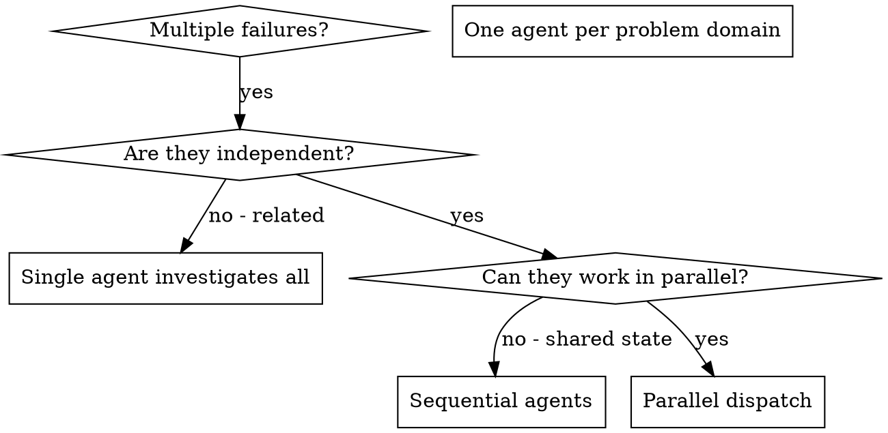

# 派发并行智能体

## 概述

当你有多个不相关故障（不同测试文件、不同子系统、不同 bug）时，顺序调查会浪费时间。每个调查相互独立，可以并行进行。

**核心原则：** 为每个独立问题域派发一个智能体。让它们并发工作。

**开始时宣布：**「我正在使用 dispatching-parallel-agents 技能派发并行智能体处理独立问题域。」

## 何时使用



**使用场景：**
- 3+ 个测试文件失败且根因不同
- 多个子系统各自独立损坏
- 每个问题无需其他问题上下文即可理解
- 调查之间无共享状态

**不使用场景：**
- 故障相关（修一个可能修好其他）
- 需要理解完整系统状态
- 智能体会相互干扰

## 模式

### 1. 识别独立域

按损坏内容对故障分组：
- 文件 A 测试：工具审批流程
- 文件 B 测试：批次完成行为
- 文件 C 测试：中止功能

每个域独立——修工具审批不影响中止测试。

### 2. 创建聚焦的智能体任务

每个智能体获得：
- **明确范围：** 一个测试文件或子系统
- **清晰目标：** 让这些测试通过
- **约束：** 不改动其他代码
- **期望输出：** 发现与修复的摘要

### 3. 并行派发

```typescript
// In Claude Code / AI environment
Task("Fix agent-tool-abort.test.ts failures")
Task("Fix batch-completion-behavior.test.ts failures")
Task("Fix tool-approval-race-conditions.test.ts failures")
// All three run concurrently
```

### 4. 审查与集成

当智能体返回时：
- 阅读每个摘要
- 确认修复无冲突
- 运行完整测试套件
- 集成所有变更

## 智能体提示结构

好的智能体提示具备：
1. **聚焦** - 一个清晰的问题域
2. **自包含** - 理解问题所需的全部上下文
3. **输出具体** - 智能体应返回什么？

```markdown
Fix the 3 failing tests in src/agents/agent-tool-abort.test.ts:

1. "should abort tool with partial output capture" - expects 'interrupted at' in message
2. "should handle mixed completed and aborted tools" - fast tool aborted instead of completed
3. "should properly track pendingToolCount" - expects 3 results but gets 0

These are timing/race condition issues. Your task:

1. Read the test file and understand what each test verifies
2. Identify root cause - timing issues or actual bugs?
3. Fix by:
   - Replacing arbitrary timeouts with event-based waiting
   - Fixing bugs in abort implementation if found
   - Adjusting test expectations if testing changed behavior

Do NOT just increase timeouts - find the real issue.

Return: Summary of what you found and what you fixed.
```

## 常见错误

**❌ 范围过大：**「修好所有测试」——智能体迷失
**✅ 具体：**「修 agent-tool-abort.test.ts」——范围聚焦

**❌ 无上下文：**「修竞态条件」——智能体不知在哪
**✅ 有上下文：** 粘贴错误信息和测试名

**❌ 无约束：** 智能体可能大改一切
**✅ 有约束：**「不要改生产代码」或「只修测试」

**❌ 输出模糊：**「修好它」——不知道改了什么
**✅ 具体：**「返回根因及变更的摘要」

## 何时不使用

**相关故障：** 修一个可能修好其他——先一起调查
**需要完整上下文：** 理解需要看整个系统
**探索性调试：** 还不知道哪里坏了
**共享状态：** 智能体会相互干扰（编辑同一文件、使用同一资源）

## 实际案例

**场景：** 大型重构后 3 个文件共 6 个测试失败

**失败：**
- agent-tool-abort.test.ts：3 个失败（时序问题）
- batch-completion-behavior.test.ts：2 个失败（工具未执行）
- tool-approval-race-conditions.test.ts：1 个失败（执行次数 = 0）

**决策：** 独立域——中止逻辑、批次完成、竞态条件各自独立

**派发：**
```
Agent 1 → 修 agent-tool-abort.test.ts
Agent 2 → 修 batch-completion-behavior.test.ts
Agent 3 → 修 tool-approval-race-conditions.test.ts
```

**结果：**
- Agent 1：用时序等待替代 timeout
- Agent 2：修 event 结构 bug（threadId 位置错误）
- Agent 3：增加异步工具执行完成前的等待

**集成：** 所有修复独立、无冲突、完整套件通过

**节省时间：** 3 个问题并行解决 vs 顺序解决

## 核心收益

1. **并行化** - 多路调查同时进行
2. **聚焦** - 每个智能体范围窄，需跟踪的上下文更少
3. **独立性** - 智能体互不干扰
4. **速度** - 3 个问题在 1 个问题的时间内解决

## 验证

智能体返回后：
1. **审查每个摘要** - 理解变更内容
2. **检查冲突** - 智能体是否改动了同一代码？
3. **运行完整套件** - 确认所有修复协同工作
4. **抽查** - 智能体可能犯系统性错误
