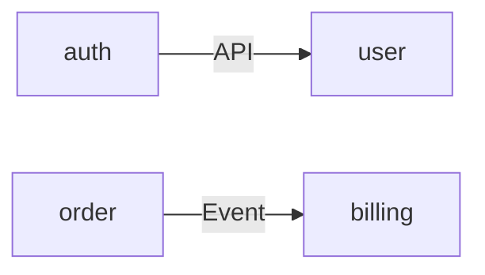

# project-discover-memory-index（Step2+3：Level-0 Memory + Level-1 索引骨架）

## 概览

这一阶段的目标是：**让任何人/AI 在几分钟内知道项目边界、权威入口、怎么跑/怎么验、从哪里进入模块与契约**。  
方法是：先把 Memory 与索引骨架落盘，并严格执行“索引只导航”的硬规则。

**开始时宣布：**「我正在使用 project-discover-memory-index 技能建立 Discover 的北极星（memory）与索引骨架（地图层）。」  

## 输出目录（标准落盘）

```
.aisdlc/project/
  memory/
    structure.md
    tech.md
    product.md
    glossary.md
  components/
    index.md
  products/
    index.md
```

> **提醒**：本阶段不要创建 `.aisdlc/project/contracts/**`；契约入口将通过模块页锚点跳转。

## Level-0：Memory 写法约束（必须短）

### 通用硬规则

- **只写稳定入口与边界**：入口链接 > 解释性长文
- **避免一次性交付细节**：详细迁移步骤/详细时序/字段级约束不写在项目级 memory
- **链接必须可定位**：优先链接到仓库内具体文件、具体 job、具体命令入口
- **缺口必须结构化**：统一写到 `## Evidence Gaps（缺口清单）`

### `memory/structure.md` 最小模板

```markdown
# 结构与入口（北极星）

## 项目形态
- 单体/多服务/Monorepo：<证据入口链接>

## 入口（可执行证据）
- 本地启动：<脚本/命令入口链接>
- 测试：<脚本/命令入口链接>
- 构建/发布：<CI job/脚本入口链接>

## 代码地图
- 组件地图：../components/index.md
- 业务地图（如有）：../products/index.md
- Ops 入口（如有）：../ops/index.md

## Evidence Gaps（缺口清单）
- 缺口：
  - 期望补齐到的粒度：
  - 候选证据位置：
  - 影响：
```

### `memory/tech.md` 最小模板

```markdown
# 技术栈与工程护栏

## 技术栈（稳定选择）
- 语言/框架：
- 数据库/缓存/消息：

## 质量门禁入口（可执行证据）
- lint：
- test：
- 安全扫描：

## NFR 入口
- 性能/可用性/成本/安全：../nfr.md（或外部权威链接）

## Evidence Gaps（缺口清单）
...
```

### `memory/product.md` 最小模板

```markdown
# 业务边界（稳定语义）

## In / Out
- In：
- Out：

## 业务地图入口
- ../products/index.md（如有）

## 术语入口
- ./glossary.md

## Evidence Gaps（缺口清单）
...
```

### `memory/glossary.md` 最小模板

```markdown
# 术语表（短）

| 术语 | 一句话定义 | 权威出处 |
|---|---|---|
| xxx | ... | <链接到模块页锚点/ADR/代码证据> |
```

## Level-1：索引骨架（地图层）约束

### 索引硬规则（可检查）

- `components/index.md` 与 `products/index.md` **只做导航**
- 禁止在索引中出现：
  - 不变量摘要
  - 字段/错误码/详细流程
  - “待补/未发现/TODO/待确认”
- 索引用复选框做进度面板，但**不得**作为完成判断依据（完成只看模块页是否达标）

### `components/index.md` 最小模板（含依赖图）

```markdown
# Components Index（地图层：只导航）

| module | priority | owner | code_entry | api_contract | data_contract | ops_entry | status |
|--------|----------|-------|------------|--------------|---------------|-----------|--------|
| auth | P0 | team-x | `src/auth/` | [api](./auth.md#api-contract) | [data](./auth.md#data-contract) | [ops](../ops/index.md) | - [ ] |

## Dependencies（direct only）


```

> **维护规则**：只画**直接依赖**（一级调用），不画传递依赖；边标注交互方式（API/Event/DB）。

### `products/index.md` 最小模板（可选，但建议）

```markdown
# Products Index（业务地图：只导航）

> 建议收敛到 <= 6 个业务模块；这里不是功能清单。

| product | owner | entry | related_components | status |
|---|---|---|---|---|
| commerce | team-a | ./commerce.md | auth, order | - [ ] |
```

## 红旗清单

- Memory 写成“操作手册大全”（项目级必须短）
- 索引里出现“待补/未发现/TODO”（缺口应进模块页或 memory 的 Evidence Gaps）
- 在索引里复制模块细节（双写必漂移）

## 常见错误

- 先写模块页细节再补索引（会诱发索引双写）
- 把 Products 变成 20+ 个模块的功能目录（地图失效）

